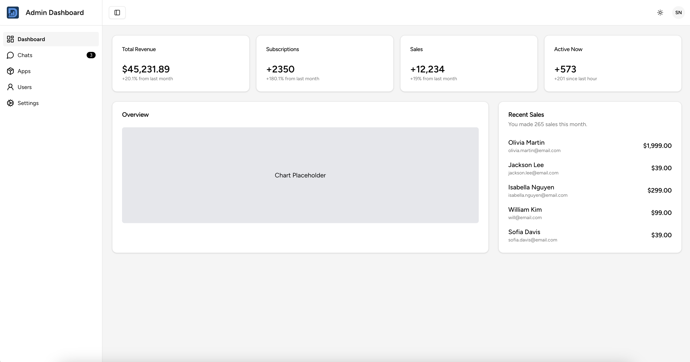
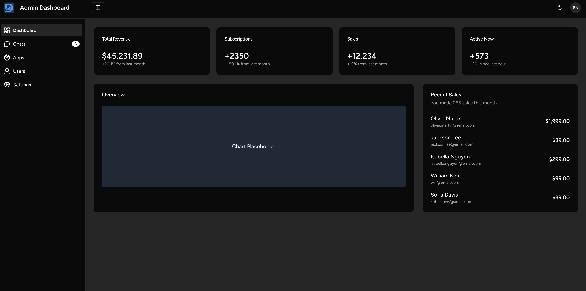

# ✨ Admin Dashboard Shadcn



**Admin Dashboard Shadcn** adalah dashboard modern, ringan, dan fleksibel yang dirancang dengan teknologi terkini seperti Laravel, Inertia.js, React, dan komponen UI elegan dari **Shadcn/UI**. Cocok untuk aplikasi internal perusahaan, CMS, dan kebutuhan admin lainnya.

---

## 🔧 Tech Stack

🚀 Performa tinggi dengan stack teknologi modern:

- ⚙️ **Laravel** – Kuat dan aman di sisi backend
- 🔗 **Inertia.js** – Menjembatani Laravel dan React
- ⚛️ **React.js** – UI interaktif dan dinamis
- 💅 **Shadcn/UI** – Komponen UI siap pakai berbasis TailwindCSS
- 🎨 **TailwindCSS** – Framework CSS utility-first
- ⚡ **Vite** – Build tool super cepat

---

## 🌐 Demo

🔗 [Coba Live Demo](https://admin-dashboard-shadcn.vercel.app)

---

## ⚙️ Cara Instalasi

Langkah mudah untuk mulai menggunakan proyek ini:

### 1. Clone Repository
```bash
git clone https://github.com/darmansrb/admin-dashboard-Shadcn.git
cd admin-dashboard-Shadcn
```

### 2. Install Backend
```bash
composer install
cp .env.example .env
php artisan key:generate
php artisan migrate
```

### 3. Install Frontend
```bash
npm install
```

### 4. Compile Aset
```bash
npm run dev
```

### 5. Jalankan Server
```bash
php artisan serve
```

💡 Akses aplikasi di: [http://localhost:8000](http://localhost:8000)

---

## 🖼️ Screenshots

| 🌞 Light Mode | 🌚 Dark Mode |
|--------------|--------------|
|  |  |

---

## 💡 Fitur Unggulan

✅ Autentikasi berbasis role  
✅ Sidebar responsif (dark & light mode)  
✅ Modular UI dengan komponen Shadcn  
✅ Routing SPA dengan Inertia.js  
✅ Validasi form & notifikasi dinamis

---

## 🗂️ Struktur Folder

```
├── app/
├── resources/
│   └── js/
│       ├── Pages/
│       ├── Components/
│       └── Layouts/
├── routes/
│   └── web.php
├── public/
└── ...
```

---

## 🤝 Kontribusi

Ingin menambahkan fitur baru atau memperbaiki bug? Pull request dan issue sangat kami apresiasi 🙌

---

## 📄 Lisensi

MIT License – Silakan gunakan dan modifikasi sesuai kebutuhanmu.

---

## 🛠️ Catatan Pengembangan

**File UI yang bisa kamu sesuaikan:**
- `resource/js/components/ui/NavBar.jsx`
- `resource/js/components/ui/NavItem.jsx`
- `resource/js/components/ui/SideBar.jsx`
- `resource/js/components/ui/StatCard.jsx`

**Untuk mengatur layout halaman:**
- `resource/js/layouts/AdminLayouts.jsx`

**Halaman utama berada di folder:**
- `resource/js/Pages/`

Selamat berkarya! 🚀

